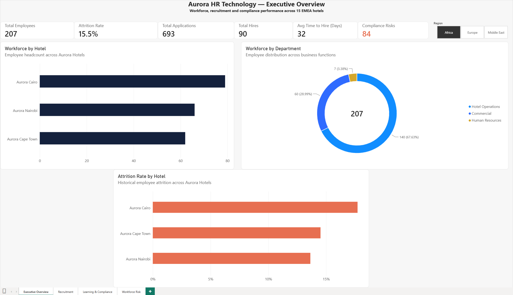

# Aurora HR Technology Platform

Aurora is a fictional hotel group's end-to-end HR technology platform, built to demonstrate how data, automation, analytics and responsible AI can support HR operations across a multi-country organisation.

The platform integrates workforce, recruitment, learning and compliance data into a common HR data model. Python handles data processing, workflow automation and machine learning; SQLite and SQL provide the analytical data layer; and Power BI presents management-level insights through an interactive dashboard.

## Dashboard



The Power BI Executive Overview provides management with a consolidated view of workforce, recruitment and compliance performance across 15 fictional EMEA hotels.

Key metrics include:

- 1,470 employees
- 5,000 recruitment applications
- 663 hires
- 32-day average time-to-hire
- 16.1% historical attrition rate
- 612 identified compliance risks

The dashboard supports interactive filtering by region and analysis at hotel and department level.

## Project Goals

Aurora was designed to demonstrate how several HR technology processes can be integrated into one platform:

- Build an integrated HR data model across multiple HR processes
- Analyse recruitment performance and time-to-hire
- Monitor employee learning and mandatory training compliance
- Automate the identification and prioritisation of overdue compliance training
- Explore employee attrition patterns using interpretable machine learning
- Apply responsible AI principles to HR analytics
- Provide management-level HR reporting through Power BI
- Create a reproducible data pipeline that can rebuild the platform from source data

## System Architecture

```text
HRIS / Workforce Data
        │
        ├── Recruitment Data
        │
        └── Learning & Training Data
        │
        ▼
Data Processing & Transformation
        │
        │  Python / pandas
        ▼
SQLite HR Database
        │
        ├── employees
        ├── hotels
        ├── recruitment
        ├── training
        └── attrition_risk
        │
        ▼
SQL Analytics
        │
        ├── Recruitment Performance
        ├── Training Compliance
        ├── Workforce Risk
        └── Management Reporting
        │
        ├─────────────────────┐
        ▼                     ▼
Workflow Automation     Responsible AI
Compliance Alerts       Attrition Risk Model
        │                     │
        └──────────┬──────────┘
                   ▼
                Power BI
          Executive Dashboard
```

## Core Modules

### 1. Workforce / HRIS

The workforce module provides the core employee dataset used throughout the platform.

Employee records are transformed and distributed across 15 fictional Aurora hotels in Europe, the Middle East and Africa.

This provides the common workforce layer connecting recruitment, learning, compliance and workforce analytics.

### 2. Recruitment Analytics

A synthetic recruitment dataset of 5,000 applications models hiring activity across Aurora hotels.

The module supports analysis of:

- Applications and hires
- Recruitment source performance
- Source-level hire rates
- Time-to-hire
- Recruitment performance by hotel and region

The generated recruitment data is integrated with the wider HR data model for SQL and Power BI analysis.

### 3. Learning & Compliance

The learning module models employee training assignments across compliance, service, leadership and digital courses.

Training records track:

- Assigned and due dates
- Completion status
- Training scores and hours
- Mandatory training requirements
- Overdue compliance training

The resulting data enables compliance performance to be analysed across employees, hotels and regions.

### 4. Compliance Automation

A Python workflow automatically identifies overdue mandatory training and calculates the number of days each case has been overdue.

Cases are classified into:

- Low
- Medium
- High
- Critical

Priority levels are mapped to recommended actions such as employee reminders, line-manager notifications and HR escalation.

The workflow identified 612 compliance-risk cases in the generated dataset and produces a structured management action report.

### 5. Responsible Attrition AI

An interpretable logistic regression model was developed to explore patterns associated with employee attrition.

On the held-out test set, the selected model achieved:

- **ROC-AUC:** 0.833
- **Attrition recall:** 0.74
- **Attrition precision:** 0.39
- **Attrition F1-score:** 0.51

The model is designed as a decision-support and workforce analytics tool rather than an automated employment decision system.

Age was evaluated during development and then removed from the final operational model. Predictive performance was maintained after its removal. Gender and marital status are also excluded from prediction features.

Model coefficients are used to examine factors associated with predicted attrition risk. These relationships are treated as predictive associations rather than evidence of causation.

The generated risk scores therefore demonstrate how HR teams could prioritise further investigation rather than determine employment actions automatically.

## One-Command Build

The complete Aurora data platform can be rebuilt using:

```bash
python build_aurora.py
```

The build pipeline runs the project components in sequence:

```text
Workforce transformation
        ↓
Hotel generation
        ↓
Recruitment generation
        ↓
Training generation
        ↓
Attrition risk modelling
        ↓
SQLite database creation
        ↓
Compliance automation
```

The build stops automatically if one of the pipeline stages fails.

Generated datasets and the local SQLite database are excluded from version control and recreated by the pipeline.

## Technology Stack

- **Python** — data processing, automation and orchestration
- **pandas / NumPy** — data transformation and synthetic data generation
- **scikit-learn** — preprocessing, logistic regression and model evaluation
- **SQLite** — integrated HR data storage
- **SQL** — recruitment, compliance, workforce and management analysis
- **Power BI / DAX** — interactive management reporting and visualisation
- **Git & GitHub** — version control and project documentation

## Repository Structure

```text
aurora-hr-tech/
│
├── data/
│   ├── raw/
│   │   └── employees.csv
│   └── processed/                 # Generated datasets (Git ignored)
│
├── src/
│   ├── explore_data.py
│   ├── transform_employees.py
│   ├── generate_hotels.py
│   ├── generate_recruitment.py
│   ├── analyse_recruitment.py
│   ├── generate_training.py
│   ├── compliance_alerts.py
│   ├── attrition_model.py
│   └── create_database.py
│
├── sql/
│   ├── 01_recruitment_analysis.sql
│   ├── 02_training_analysis.sql
│   ├── 03_attrition_analysis.sql
│   └── 04_management_summary.sql
│
├── dashboard/
│   └── Aurora_HR_Technology.pbix
│
├── docs/
│   └── aurora-dashboard.png
│
├── build_aurora.py
├── requirements.txt
├── .gitignore
└── README.md
```

## Running the Project

Clone the repository:

```bash
git clone https://github.com/tazin-ahmed-sifat/aurora-hr-tech.git
cd aurora-hr-tech
```

Create and activate a virtual environment, then install the required packages:

```bash
pip install -r requirements.txt
```

Run the complete pipeline:

```bash
python build_aurora.py
```

This regenerates the processed datasets, attrition-risk output, compliance action report and SQLite HR database.

The Power BI report is available at:

```text
dashboard/Aurora_HR_Technology.pbix
```

## Data & Project Scope

Aurora represents a **fictional organisation** created for portfolio and educational purposes.

The project uses the IBM HR Analytics Employee Attrition & Performance dataset as the starting workforce dataset. Additional organisational, recruitment and learning data used by Aurora are synthetically generated for the project.

The outputs should therefore be interpreted as demonstrations of HR technology, analytics and automation techniques rather than findings about a real organisation.

## Responsible AI

Employee-related predictive analytics require particular care because model outputs can affect people if used without appropriate oversight.

For this project:

- The model is positioned as decision support rather than automated decision-making
- Age was tested and removed from the final operational feature set
- Gender and marital status are excluded from prediction features
- Model performance is evaluated on a held-out test set
- Predictive associations are not presented as causal relationships
- Risk scores are intended to identify areas for investigation, not determine employment decisions

## Use of AI Tools

Large Language Models (LLMs) were used during development as a supporting tool for:

- Brainstorming and refining the project concept
- Discussing system architecture and implementation approaches
- Troubleshooting coding errors and development hurdles
- Explaining unfamiliar concepts and alternative solutions
- Reviewing and improving code during development

The project was developed iteratively, with implementation decisions, testing, debugging and validation carried out throughout development. AI-generated suggestions were reviewed, tested and adapted rather than treated as automatically correct.